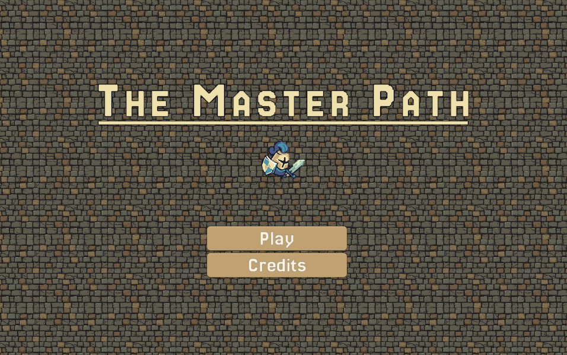
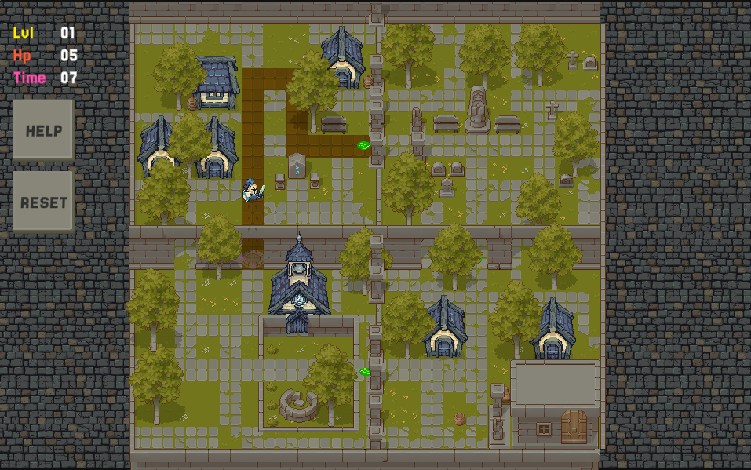
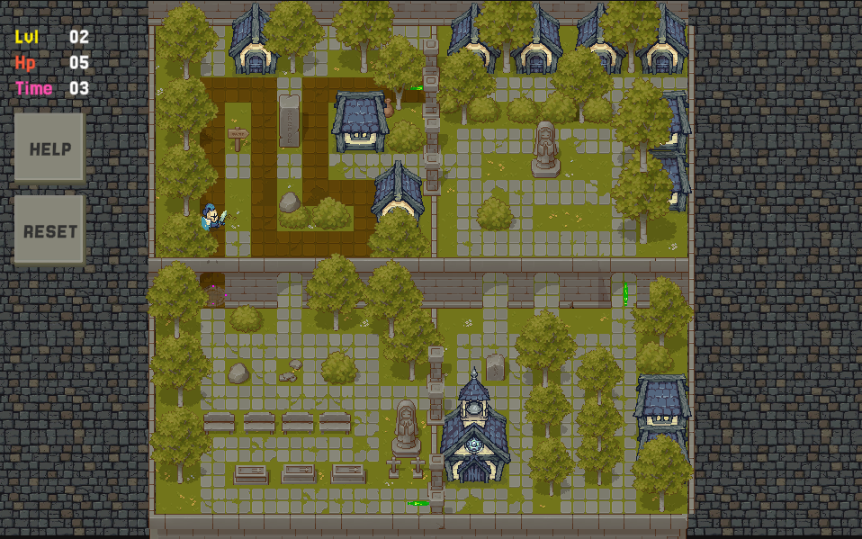

# ⚔️ The Master Path

The Master Path is a 2D top-down puzzle game set within the Labyrinthine City, a magical prison of shifting medieval architecture. Players must memorize a "Master Path" in a stable district and then recreate it across three subsequent zones that physically rotate the world by 90, 180, and 270 degrees. Using pure spatial reasoning to navigate cobblestone courtyards and grand archways, players must stay on the invisible path or trigger a total reality collapse that resets the level. Completing the final rotation closes a magical loop, shattering the sorcerer's illusion and liberating the Knight.

## 🎮 Gameplay

- **Grid Movement** — Navigate one tile at a time across hand-crafted levels
- **Map Destruction** — Quadrants of the map dissolve with shader-driven effects as you progress
- **Teleportation Portals** — Step into portals to warp across the level
- **Health System** — Start with 5 HP; hitting obstacles costs a life and resets you to a checkpoint
- **Timer** — Each level is timed, with results shown on completion
- **Hideable Tilemaps** — Tiles fade in and out based on your actions

## 📸 Screenshots





## 📁 Project Structure

```
Assets/
├── Scripts/           # Game logic (Player, Map, UI, Audio, Editor)
├── Scenes/            # Menu, Level1, Level2
├── Prefabs/           # Player, HUD, GhostTile, portals, environment
├── Sprites/           # Character, UI, portals, terrain
├── Animations/        # Knight states, portal, fade transitions
├── Shaders/           # Dissolve, glow, silhouette, blink effects
├── SFX/               # Footsteps, ambience, shatter, armor impacts
├── Fonts/             # Jersey25
├── Materials/         # Shader materials
├── TilePalettes/      # Tilemap brushes
├── Cainos/            # Pixel Art Top Down asset pack
└── Tiny Swords/       # Medieval-themed asset pack
```

## 🛠️ Tech Stack

- **Engine:** Unity 6 (6.0.3.2f1)
- **Render Pipeline:** Universal Render Pipeline (URP) 17.3
- **Input:** Unity Input System 1.17
- **Language:** C#
- **2D Toolkit:** Unity 2D Feature Set 2.0

## 🚀 Getting Started

### 📋 Prerequisites

- Unity 6.0.3.2f1 or compatible version (install via [Unity Hub](https://unity.com/download))

### ⚙️ Setup

1. Clone the repository:
   ```bash
   git clone <repository-url>
   ```
2. Open the project in Unity Hub.
3. Open `Assets/Scenes/Menu.unity` to start from the main menu.
4. Press **Play** in the Unity Editor.

## 🕹️ Controls

| Action | Input |
|--------|-------|
| Move   | WASD |

## 🗺️ Scenes

| Scene  | Description |
|--------|-------------|
| Menu   | Main menu with Play and Credits |
| Level1 | First playable level |
| Level2 | Second playable level |

## 🙏 Credits

### 🎨 Visual Assets

| Asset | Author | Link |
|-------|--------|------|
| Jersey25 (Font) | The Soft Type Project Authors | [Google Fonts](https://fonts.google.com/specimen/Jersey+25) |
| Pixel Art Top Down - Basic | Cainos | [Unity Asset Store](https://assetstore-fallback.unity.com/packages/2d/environments/pixel-art-top-down-basic-187605) |
| Tiny Swords | Pixel Frog | [Unity Asset Store](https://assetstore.unity.com/packages/2d/environments/tiny-swords-352566) |
| Noise Textures (map crumble effect) | Screaming Brain Studios | [OpenGameArt](https://opengameart.org/content/700-noise-textures) |
| 2D Pixel Art Portal Sprites | Elthen's Pixel Art Shop | [itch.io](https://elthen.itch.io/2d-pixel-art-portal-sprites) |
| Border Texture | — | [Idyllic](https://us.idyllic.app/gen/pixel-art-dungeon-wall-tile-317274) |

### 🔊 Audio Assets

| Asset | Author | Link |
|-------|--------|------|
| SFX: The Ultimate 2017 16 bit Mini pack | phoenix1291 | [OpenGameArt](https://opengameart.org/content/sfx-the-ultimate-2017-16-bit-mini-pack) |
| Park Ambiences | Thimras | [OpenGameArt](https://opengameart.org/content/park-ambiences) |
| Lightmetal_armor | mitchanary | [Freesound](https://freesound.org/people/mitchanary/sounds/506148/) |
| Halloween Night Waltz | HarumachiMusic | [Pixabay](https://pixabay.com/music/mystery-halloween-night-waltz-238151/) |
| Different Steps on Wood, Stone, Leaves, Gravel and Mud | TinyWorlds | [OpenGameArt](https://opengameart.org/content/different-steps-on-wood-stone-leaves-gravel-and-mud) |
| Geometry Dash Death | Chris02_B | [MyInstants](https://www.myinstants.com/en/instant/geometry-dash-death-33350/) |
| Win5 | — | [ElevenLabs](https://elevenlabs.io/sound-effects/win) |
| Rock Smash | NeoSpica | [Pixabay](https://pixabay.com/sound-effects/nature-rock-smash-6304/) |
